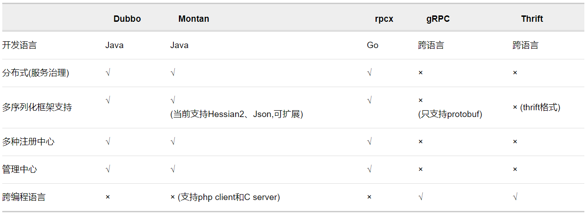

### go语言适用的rpc框架

+ rpcx
  + 一款针对go语言的rpc框架，基于go原生rpc库进行开发，性能比较爆炸。
+ grpc
  + google，star数量最多，社区完善，文档丰富
+ thrift
  + facebook/Apache，文档少
  + 字节跳动服务端通信采用的框架，其序列化协议采用protocbuf

### 相关调研链接

+ <a href=https://scguoi.github.io/DivisionByZero/2016/11/15/GO语言RPC方案调研.html#3-对比测试>Go语言rpc方案调研</a>
  + 包含了三种框架的简单demo以及三种框架的特点对比以及性能对比
  + 

+ <a href= https://colobu.com/2016/09/05/benchmarks-of-popular-rpc-frameworks/>分布式rpc框架性能对比</a>
  + 本文时间较早，参考性未知
  + motan、rpcx、grpc、thrift等框架的功能对比以及性能对比
  + 功能对比
  + 

